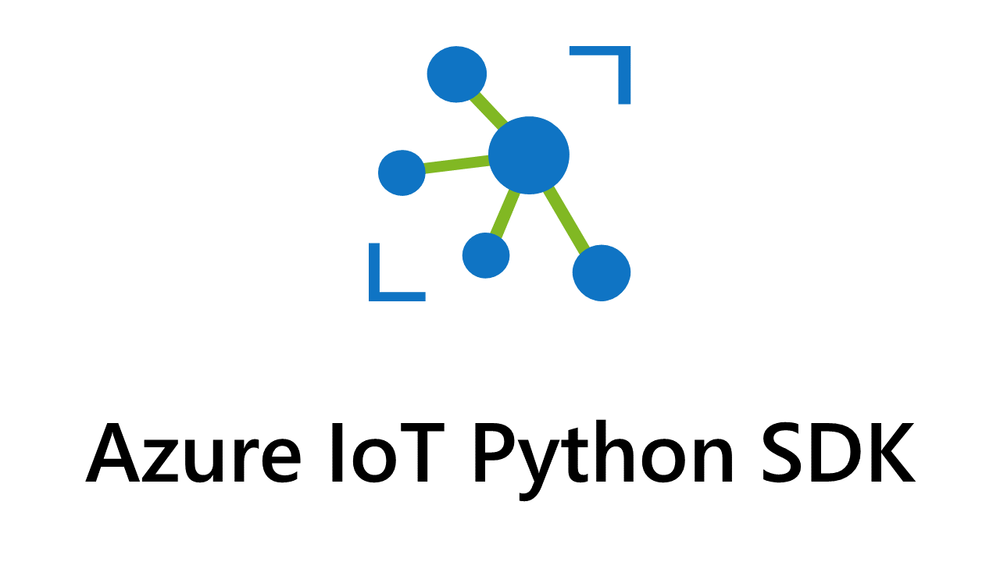

#
<div align=center>
    </img>
    <h1> azure-iot-device </h1>
</div>


The Azure IoT Device SDK for Python enables Python developers to easily create IoT device solutions that seamlessly connect to the Azure IoT Hub ecosystem.

* *If you're looking for the azure-iot-hub library, it is now located in the [azure-iot-hub-python](https://github.com/Azure/azure-iot-hub-python) repository*

* *If you're looking for the v1.x.x client library, it is now preserved in the [v1-deprecated](https://github.com/Azure/azure-iot-sdk-python/tree/v1-deprecated) branch.*


## Installing the library

The Azure IoT Device library is available on PyPI:

```Shell
pip install azure-iot-device
```

Python 3.6 or higher is required in order to use the library

## Using the library
API documentation for this package is available via [**Microsoft Docs**](https://docs.microsoft.com/python/api/azure-iot-device/azure.iot.device?view=azure-python).

See our [**quickstart guide**](https://github.com/Azure/azure-iot-sdk-python/tree/main/samples/README.md) for step by step instructions for setting up and using an IoTHub with devices. 

You can also view the [**samples repository**](https://github.com/Azure/azure-iot-sdk-python/tree/main/samples) to see additional examples of basic client usage.

Want to start off on the right foot? Be sure to learn about [**common pitfalls**](https://github.com/Azure/azure-iot-sdk-python/wiki/pitfalls) of using this Python SDK before starting a project.  


## Features

:heavy_check_mark: feature available  :heavy_multiplication_x: feature planned but not yet supported  :heavy_minus_sign: no support planned*

*Features that are not planned may be prioritized in a future release, but are not currently planned

These clients only support the **MQTT protocol**.

### IoTHub Device Client

| Features                                                                                                         | Status                     | Description                                                                                                                                                                                                          |
|------------------------------------------------------------------------------------------------------------------|----------------------------|----------------------------------------------------------------------------------------------------------------------------------------------------------------------------------------------------------------------|
| [Authentication](https://docs.microsoft.com/en-us/azure/iot-hub/iot-hub-security-deployment)                     | :heavy_check_mark:         | Connect your device to IoT Hub securely with supported authentication, including symmetric key, X-509 Self Signed, Certificate Authority (CA) Signed, and SASToken                                     |
| [Send device-to-cloud message](https://docs.microsoft.com/en-us/azure/iot-hub/iot-hub-devguide-messages-d2c)     | :heavy_check_mark:         | Send device-to-cloud messages (max 256KB) to IoT Hub with the option to add custom properties.                                                                                                                       |
| [Receive cloud-to-device messages](https://docs.microsoft.com/en-us/azure/iot-hub/iot-hub-devguide-messages-c2d) | :heavy_check_mark:         | Receive cloud-to-device messages and read associated custom and system properties from IoT Hub.                                                        |
| [Device Twins](https://docs.microsoft.com/en-us/azure/iot-hub/iot-hub-devguide-device-twins)                     | :heavy_check_mark:         | IoT Hub persists a device twin for each device that you connect to IoT Hub.  The device can perform operations like get twin tags, subscribe to desired properties.                                                |
| [Direct Methods](https://docs.microsoft.com/en-us/azure/iot-hub/iot-hub-devguide-direct-methods)                 | :heavy_check_mark:         | IoT Hub gives you the ability to invoke direct methods on devices from the cloud.  The SDK supports handler for method specific and generic operation.                                                            |
| [Connection Status and Error reporting](https://docs.microsoft.com/en-us/rest/api/iothub/common-error-codes)     | :heavy_check_mark:   | Error reporting for IoT Hub supported error code.                                                                                         |
| Connection Retry                                                                                                   | :heavy_check_mark:         | Dropped connections will be retried with a fixed 10 second interval by default. This functionality can be disabled if desired, and the interval can be configured   |
| [Upload file to Blob](https://docs.microsoft.com/en-us/azure/iot-hub/iot-hub-devguide-file-upload)               | :heavy_check_mark:         | A device can initiate a file upload and notifies IoT Hub when the upload is complete.  |

### IoTHub Module Client

**Note:** IoT Edge for Python is scoped to Linux containers & devices only. [Learn more](https://techcommunity.microsoft.com/t5/internet-of-things/linux-modules-with-azure-iot-edge-on-windows-10-iot-enterprise/ba-p/1407066) about using Linux containers for IoT edge on Windows devices. 

| Features                                                                                                         | Status                     | Description                                                                                                                                                                                                          |
|------------------------------------------------------------------------------------------------------------------|----------------------------|----------------------------------------------------------------------------------------------------------------------------------------------------------------------------------------------------------------------|
| [Authentication](https://docs.microsoft.com/en-us/azure/iot-hub/iot-hub-security-deployment)                     | :heavy_check_mark:         | Connect your device to IoT Hub securely with supported authentication, including symmetric key, X-509 Self Signed, and Certificate Authority (CA) Signed. SASToken authentication is not currently supported.                                                   |
| [Send device-to-cloud message](https://docs.microsoft.com/en-us/azure/iot-hub/iot-hub-devguide-messages-d2c)     | :heavy_check_mark:         | Send device-to-cloud messages (max 256KB) to IoT Hub with the option to add custom properties.                                                                                                                       |
| [Receive cloud-to-device messages](https://docs.microsoft.com/en-us/azure/iot-hub/iot-hub-devguide-messages-c2d) | :heavy_check_mark:         | Receive cloud-to-device messages and read associated custom and system properties from IoT Hub, with the option to complete/reject/abandon C2D messages.                                                        |
| [Device Twins](https://docs.microsoft.com/en-us/azure/iot-hub/iot-hub-devguide-device-twins)                     | :heavy_check_mark:         | IoT Hub persists a device twin for each device that you connect to IoT Hub.  The device can perform operations like get twin tags, subscribe to desired properties.                                                |
| [Direct Methods](https://docs.microsoft.com/en-us/azure/iot-hub/iot-hub-devguide-direct-methods)                 | :heavy_check_mark:         | IoT Hub gives you the ability to invoke direct methods on devices from the cloud.  The SDK supports handler for method specific and generic operation.                                                            |
| [Connection Status and Error reporting](https://docs.microsoft.com/en-us/rest/api/iothub/common-error-codes)     | :heavy_check_mark:   | Error reporting for IoT Hub supported error code.                                                                                         |
| Connection Retry                                                                                                   | :heavy_check_mark:         | Dropped connections will be retried with a fixed 10 second interval.  TThis functionality can be disabled if desired, and the interval can be configured            |
| Direct Invocation of Method on Modules                                                                           | :heavy_check_mark:         | Invoke method calls to another module using using the Edge Gateway.                                                                                                                                        |

### Provisioning Device Client

| Features                    | Status             | Description                                                                                                                                                                                                                                                                                                                                        |
|-----------------------------|--------------------|----------------------------------------------------------------------------------------------------------------------------------------------------------------------------------------------------------------------------------------------------------------------------------------------------------------------------------------------------|
| TPM Individual Enrollment   | :heavy_minus_sign: | Provisioning via [Trusted Platform Module](https://docs.microsoft.com/en-us/azure/iot-dps/concepts-security#trusted-platform-module-tpm).                                                                                                                                                                                                          |
| X.509 Individual Enrollment | :heavy_check_mark: | Provisioning via [X.509 root certificate](https://docs.microsoft.com/en-us/azure/iot-dps/concepts-security#root-certificate).  Please review the [samples](azure-iot-device/samples/async-hub-scenarios/provision_x509.py) folder and this [quickstart](https://docs.microsoft.com/en-us/azure/iot-dps/quick-create-simulated-device-x509-python) on how to create a device client.   |
| X.509 Enrollment Group      | :heavy_check_mark: | Provisioning via [X.509 leaf certificate](https://docs.microsoft.com/en-us/azure/iot-dps/concepts-security#leaf-certificate)).  Please review the [samples](azure-iot-device/samples/async-hub-scenarios/provision_x509.py) folder on how to create a device client.                                                                                                                  |
| Symmetric Key Enrollment    | :heavy_check_mark: | Provisioning via [Symmetric key attestation](https://docs.microsoft.com/en-us/azure/iot-dps/concepts-symmetric-key-attestation)).  Please review the [samples](azure-iot-device/samples/async-hub-scenarios/provision_symmetric_key.py) folder on how to create a device client.                                                                                                               |

## Critical Upcoming Changes Notice

### Certificates
All Azure IoT SDK users are advised to be aware of upcoming TLS certificate changes for Azure IoT Hub and Device Provisioning Service 
that will impact the SDK's ability to connect to these services. In October 2022, both services will migrate from the current 
[Baltimore CyberTrust CA Root](https://baltimore-cybertrust-root.chain-demos.digicert.com/info/index.html) to the 
[DigiCert Global G2 CA root](https://global-root-g2.chain-demos.digicert.com/info/index.html). There will be a 
transition period beforehand where your IoT devices must have both the Baltimore and Digicert public certificates 
installed in their certificate store in order to prevent connectivity issues.

**Devices with only the Baltimore public certificate installed will lose the ability to connect to Azure IoT hub and Device Provisioning Service in October 2022.**

To prepare for this change, make sure your device's certificate store has both of these public certificates installed.

For a more in depth explanation as to why the IoT services are doing this, please see
[this article](https://techcommunity.microsoft.com/t5/internet-of-things/azure-iot-tls-critical-changes-are-almost-here-and-why-you/ba-p/2393169).


## Contributing

This project welcomes contributions and suggestions.  Most contributions require you to agree to a
Contributor License Agreement (CLA) declaring that you have the right to, and actually do, grant us
the rights to use your contribution. For details, visit https://cla.microsoft.com.

When you submit a pull request, a CLA-bot will automatically determine whether you need to provide
a CLA and decorate the PR appropriately (e.g., label, comment). Simply follow the instructions
provided by the bot. You will only need to do this once across all repos using our CLA.

This project has adopted the [Microsoft Open Source Code of Conduct](https://opensource.microsoft.com/codeofconduct/).
For more information see the [Code of Conduct FAQ](https://opensource.microsoft.com/codeofconduct/faq/) or
contact [opencode@microsoft.com](mailto:opencode@microsoft.com) with any additional questions or comments.
