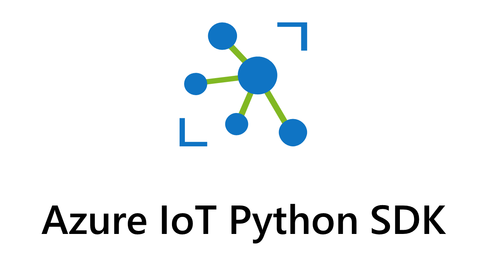

#

    </img>
    <h1> V2 - We are now GA! </h1>

This repository contains code for the Azure IoT SDKs for Python.  This enables python developers to easily create IoT device solutions that semealessly
connection to the Azure IoTHub ecosystem.

*If you're looking for the v1.x.x client library, it is now preserved in the [v1-deprecated](https://github.com/Azure/azure-iot-sdk-python/tree/v1-deprecated) branch.*

## Azure IoT SDK for Python

This repository contains the following libraries:

* [Azure IoT Device library](https://github.com/Azure/azure-iot-sdk-python/blob/master/azure-iot-device/README.md)

* [Azure IoT Hub Service library](https://github.com/Azure/azure-iot-sdk-python/blob/master/azure-iot-hub/README.md)

* Coming Soon: Azure IoT Device Provisioning Service Library

## Installing the libraries

Pip installs are provided for all of the SDK libraries in this repo:

[Device libraries](https://github.com/Azure/azure-iot-sdk-python/tree/master/azure-iot-device#installation)

[IoTHub library](https://github.com/Azure/azure-iot-sdk-python/blob/master/azure-iot-hub/README.md#installation)

## Features

:heavy_check_mark: feature available  :heavy_multiplication_x: feature planned but not yet supported  :heavy_minus_sign: no support planned*

*Features that are not planned may be prioritized in a future release, but are not currently planned

### Device Client Library ([azure-iot-device](https://github.com/Azure/azure-iot-sdk-python/tree/master/azure-iot-device))

#### IoTHub Device Client

| Features                                                                                                         | Status                     | Description                                                                                                                                                                                                          |
|------------------------------------------------------------------------------------------------------------------|----------------------------|----------------------------------------------------------------------------------------------------------------------------------------------------------------------------------------------------------------------|
| [Authentication](https://docs.microsoft.com/en-us/azure/iot-hub/iot-hub-security-deployment)                     | :heavy_check_mark:         | Connect your device to IoT Hub securely with supported authentication, including private key, SASToken, X-509 Self Signed and Certificate Authority (CA) Signed.                                                     |
| [Send device-to-cloud message](https://docs.microsoft.com/en-us/azure/iot-hub/iot-hub-devguide-messages-d2c)     | :heavy_check_mark:         | Send device-to-cloud messages (max 256KB) to IoT Hub with the option to add custom properties.                                                                                                                       |
| [Receive cloud-to-device messages](https://docs.microsoft.com/en-us/azure/iot-hub/iot-hub-devguide-messages-c2d) | :heavy_check_mark:         | Receive cloud-to-device messages and read associated custom and system properties from IoT Hub, with the option to complete/reject/abandon C2D messages.                                                             |
| [Device Twins](https://docs.microsoft.com/en-us/azure/iot-hub/iot-hub-devguide-device-twins)                     | :heavy_check_mark:         | IoT Hub persists a device twin for each device that you connect to IoT Hub.  The device can perform operations like get twin tags, subscribe to desired properties.                                                  |
| [Direct Methods](https://docs.microsoft.com/en-us/azure/iot-hub/iot-hub-devguide-direct-methods)                 | :heavy_check_mark:         | IoT Hub gives you the ability to invoke direct methods on devices from the cloud.  The SDK supports handler for method specific and generic operation.                                                               |
| [Connection Status and Error reporting](https://docs.microsoft.com/en-us/rest/api/iothub/common-error-codes)     | :heavy_multiplication_x:   | Error reporting for IoT Hub supported error code.  *This SDK supports error reporting on authentication and Device Not Found.                                                                                        |
| Retry policies                                                                                                   | :heavy_check_mark:         | Retry policy for unsuccessful device-to-cloud messages.                                                                                                                                                              |

#### IoTHub Module Client

| Features                                                                                                         | Status                     | Description                                                                                                                                                                                                          |
|------------------------------------------------------------------------------------------------------------------|----------------------------|----------------------------------------------------------------------------------------------------------------------------------------------------------------------------------------------------------------------|
| [Authentication](https://docs.microsoft.com/en-us/azure/iot-hub/iot-hub-security-deployment)                     | :heavy_check_mark:         | Connect your device to IoT Hub securely with supported authentication, including private key, SASToken, X-509 Self Signed and Certificate Authority (CA) Signed.                                                     |
| [Send device-to-cloud message](https://docs.microsoft.com/en-us/azure/iot-hub/iot-hub-devguide-messages-d2c)     | :heavy_check_mark:         | Send device-to-cloud messages (max 256KB) to IoT Hub with the option to add custom properties.                                                                                                                       |
| [Receive cloud-to-device messages](https://docs.microsoft.com/en-us/azure/iot-hub/iot-hub-devguide-messages-c2d) | :heavy_check_mark:         | Receive cloud-to-device messages and read associated custom and system properties from IoT Hub, with the option to complete/reject/abandon C2D messages.                                                             |
| [Device Twins](https://docs.microsoft.com/en-us/azure/iot-hub/iot-hub-devguide-device-twins)                     | :heavy_check_mark:         | IoT Hub persists a device twin for each device that you connect to IoT Hub.  The device can perform operations like get twin tags, subscribe to desired properties.                                                  |
| [Direct Methods](https://docs.microsoft.com/en-us/azure/iot-hub/iot-hub-devguide-direct-methods)                 | :heavy_check_mark:         | IoT Hub gives you the ability to invoke direct methods on devices from the cloud.  The SDK supports handler for method specific and generic operation.                                                               |
| [Connection Status and Error reporting](https://docs.microsoft.com/en-us/rest/api/iothub/common-error-codes)     | :heavy_multiplication_x:   | Error reporting for IoT Hub supported error code.  *This SDK supports error reporting on authentication and Device Not Found.                                                                                        |
| Retry policies                                                                                                   | :heavy_check_mark:         | Retry policy for connecting disconnected devices and resubmitting messages.                                                                                                                                          |
| Direct Invocation of Method on Modules                                                                           | :heavy_check_mark:         | Invoke method calls to another module using using the Edge Gateway.                                                                                                                                                  |

#### Provisioning Device Client

| Features                    | Status             | Description                                                                                                                                                                                                                                                                                                                                        |
|-----------------------------|--------------------|----------------------------------------------------------------------------------------------------------------------------------------------------------------------------------------------------------------------------------------------------------------------------------------------------------------------------------------------------|
| TPM Individual Enrollment   | :heavy_minus_sign: | Provisioning via [Trusted Platform Module](https://docs.microsoft.com/en-us/azure/iot-dps/concepts-security#trusted-platform-module-tpm).                                                                                                                                                                                                          |
| X.509 Individual Enrollment | :heavy_check_mark: | Provisioning via [X.509 root certificate](https://docs.microsoft.com/en-us/azure/iot-dps/concepts-security#root-certificate).  Please review the [samples](./azure-iot-device/samples/sync-samples/provision_x509.py) folder and this [quickstart](https://docs.microsoft.com/en-us/azure/iot-dps/quick-create-simulated-device-x509-python) on how to create a device client.   |
| X.509 Enrollment Group      | :heavy_check_mark: | Provisioning via [X.509 leaf certificate](https://docs.microsoft.com/en-us/azure/iot-dps/concepts-security#leaf-certificate)).  Please review the [samples](./azure-iot-device/samples/sync-samples/provision_x509.py) folder on how to create a device client.                                                                                                                  |
| Symmetric Key Enrollment    | :heavy_check_mark: | Provisioning via [Symmetric key attestation](https://docs.microsoft.com/en-us/azure/iot-dps/concepts-symmetric-key-attestation)).  Please review the [samples](./azure-iot-device/samples/sync-samples/provision_symmetric_key.py) folder on how to create a device client.                                                                                                               |

### IoTHub Service Library ([azure-iot-hub](https://github.com/Azure/azure-iot-sdk-python/blob/master/azure-iot-hub/azure/iot/hub/iothub_registry_manager.py))

#### Registry Manager

| Features                                                                                                      | Status                   | Description                                                                                                                        |
|---------------------------------------------------------------------------------------------------------------|--------------------------|------------------------------------------------------------------------------------------------------------------------------------|
| [Identity registry (CRUD)](https://docs.microsoft.com/en-us/azure/iot-hub/iot-hub-devguide-identity-registry) | :heavy_check_mark:       | Use your backend app to perform CRUD operation for individual device or in bulk.                                                   |
| [Cloud-to-device messaging](https://docs.microsoft.com/en-us/azure/iot-hub/iot-hub-devguide-messages-c2d)     | :heavy_multiplication_x: | Use your backend app to send cloud-to-device messages, and set up cloud-to-device message receivers.                               |
| [Direct Methods operations](https://docs.microsoft.com/en-us/azure/iot-hub/iot-hub-devguide-direct-methods)   | :heavy_check_mark: | Use your backend app to invoke direct method on device.                                                                            |
| [Device Twins operations](https://docs.microsoft.com/en-us/azure/iot-hub/iot-hub-devguide-device-twins)       | :heavy_check_mark: | Use your backend app to perform device twin operations.  *Twin reported property update callback and replace twin are in progress. |
| [Query](https://docs.microsoft.com/en-us/azure/iot-hub/iot-hub-devguide-query-language)                       | :heavy_multiplication_x: | Use your backend app to perform query for information.                                                                             |
| [Jobs](https://docs.microsoft.com/en-us/azure/iot-hub/iot-hub-devguide-jobs)                                  | :heavy_multiplication_x: | Use your backend app to perform job operation.                                                                                     |

### IoTHub Provisioning Service Library

Feature is Coming Soon

| Features                                            | Status                   | Description                                                                                                                                    |
|-----------------------------------------------------|--------------------------|------------------------------------------------------------------------------------------------------------------------------------------------|
| CRUD Operation with TPM Individual Enrollment       | :heavy_multiplication_x: | Manage device enrollment using TPM with the service SDK.  Please visit the [samples folder](./provisioning_service_client/) to learn more about this feature.                           |
| Bulk CRUD Operation with TPM Individual Enrollment  | :heavy_multiplication_x: | Bulk manage device enrollment using TPM with the service SDK.  Please visit the [samples folder](./provisioning_service_client/) to learn more about this feature.                      |
| CRUD Operation with X.509 Individual Enrollment     | :heavy_multiplication_x: | Manages device enrollment using X.509 individual enrollment with the service SDK.  Please visit the [samples folder](./provisioning/service/samples/) to learn more about this feature.  |
| CRUD Operation with X.509 Group Enrollment          | :heavy_multiplication_x: | Manages device enrollment using X.509 group enrollment with the service SDK.  Please visit the [samples folder](./provisioning_service_client/) to learn more about this feature.        |
| Query enrollments                                   | :heavy_multiplication_x: | Query registration states with the service SDK.  Please visit the [samples folder](./provisioning_service_client/) to learn more about this feature.                                    |

## Contributing

This project welcomes contributions and suggestions.  Most contributions require you to agree to a
Contributor License Agreement (CLA) declaring that you have the right to, and actually do, grant us
the rights to use your contribution. For details, visit https://cla.microsoft.com.

When you submit a pull request, a CLA-bot will automatically determine whether you need to provide
a CLA and decorate the PR appropriately (e.g., label, comment). Simply follow the instructions
provided by the bot. You will only need to do this once across all repos using our CLA.

This project has adopted the [Microsoft Open Source Code of Conduct](https://opensource.microsoft.com/codeofconduct/).
For more information see the [Code of Conduct FAQ](https://opensource.microsoft.com/codeofconduct/faq/) or
contact [opencode@microsoft.com](mailto:opencode@microsoft.com) with any additional questions or comments.

