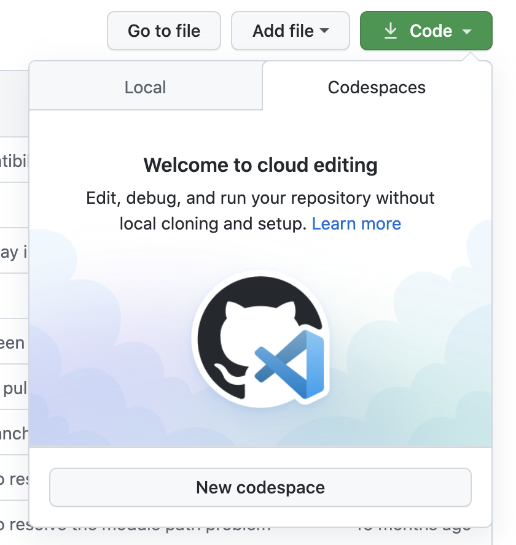

# Samples for the Azure IoT Hub Device SDK

This directory contains samples showing how to use the various features of the Microsoft Azure IoT Hub service from a device running the Azure IoT Hub Device SDK.

## Quick Start - Simple Telemetry Sample (send message)

**Note that this sample is configured for Python 3.8+.** To ensure that your Python version is up to date, run `python --version`. If you have both Python 2 and Python 3 installed (and are using a Python 3 environment for this SDK), then install all libraries using `pip3` as opposed to `pip`. This ensures that the libraries are installed to your Python 3 runtime. 

1. Install the [Azure CLI](https://docs.microsoft.com/cli/azure/install-azure-cli?view=azure-cli-latest) (or use the [Azure Cloud Shell](https://shell.azure.com/)) and use it to [create an Azure IoT Hub](https://docs.microsoft.com/cli/azure/iot/hub?view=azure-cli-latest#az_iot_hub_create).

    ```bash
    az iot hub create --resource-group <your resource group> --name <your IoT Hub name>
    ```

    * Note that this operation may take a few minutes.

2. Add the IoT Extension to the Azure CLI, and then [register a device identity](https://docs.microsoft.com/cli/azure/iot/hub/device-identity?view=azure-cli-latest#az_iot_hub_device_identity_create)

    ```bash
    az extension add --name azure-iot
    az iot hub device-identity create --hub-name <your IoT Hub name> --device-id <your device id>
    ```

3. [Retrieve your Device Connection String](https://docs.microsoft.com/cli/azure/iot/hub/device-identity/connection-string?view=azure-cli-latest#az_iot_hub_device_identity_connection_string_show) using the Azure CLI

    ```bash
    az iot hub device-identity connection-string show --device-id <your device id> --hub-name <your IoT Hub name>
    ```

    It should be in the format:

    ```Text
    HostName=<your IoT Hub name>.azure-devices.net;DeviceId=<your device id>;SharedAccessKey=<some value>
    ```

4. [Begin monitoring for telemetry](https://docs.microsoft.com/cli/azure/iot/hub?view=azure-cli-latest#az_iot_hub_monitor_events) on your IoT Hub using the Azure CLI

    ```bash
    az iot hub monitor-events --hub-name <your IoT Hub name> --output json
    ```

5. On your device, set the Device Connection String as an environment variable called `IOTHUB_DEVICE_CONNECTION_STRING`.

    **Windows (cmd)**

    ```cmd
    set IOTHUB_DEVICE_CONNECTION_STRING=<your connection string here>
    ```

    * Note that there are **NO** quotation marks around the connection string.

    **Linux (bash)**

    ```bash
    export IOTHUB_DEVICE_CONNECTION_STRING="<your connection string here>"
    ```

6. Once the Device Connection String is set, run the following code from [simple_send_message.py](simple_send_message.py) on your device from the terminal or your IDE:

    ```python
    import os
    import asyncio
    from azure.iot.device.aio import IoTHubDeviceClient


    async def main():
        # Fetch the connection string from an environment variable
        conn_str = os.getenv("IOTHUB_DEVICE_CONNECTION_STRING")

        # Create instance of the device client using the authentication provider
        device_client = IoTHubDeviceClient.create_from_connection_string(conn_str)

        # Connect the device client.
        await device_client.connect()

        # Send a single message
        print("Sending message...")
        await device_client.send_message("This is a message that is being sent")
        print("Message successfully sent!")

        # finally, shut down the client
        await device_client.shutdown()


    if __name__ == "__main__":
        asyncio.run(main())
    ```

7. Check the Azure CLI output to verify that the message was received by the IoT Hub. You should see the following output:

    ```bash
    Starting event monitor, use ctrl-c to stop...
    event:
      origin: <your Device name>
      payload: This is a message that is being sent
    ```

8. Your device is now able to connect to Azure IoT Hub!


## Read this if you want to run the sample using GitHub Codespaces

You can use Github Codespaces to be up and running quickly! Here are the steps to follow.

**1) Make sure you have the prerequisites**

In order to run the device samples you will first need the following prerequisites:

* An Azure IoT Hub instance. [Link if you don't.](https://docs.microsoft.com/en-us/azure/iot-hub/iot-hub-create-through-portal)
* A device identity for your device. [Link if you don't.](https://docs.microsoft.com/en-us/azure/iot-hub/iot-hub-create-through-portal#register-a-new-device-in-the-iot-hub)

**2) Create and open Codespace**

* Select the Codespaces tab and the "New codespace" button

  

* Once the Codespace is open, all required packages to run the samples will be setup for you

**3) Set the DEVICE_CONNECTION_STRING environment variable**

Set the Device Connection String as an environment variable called `IOTHUB_DEVICE_CONNECTION_STRING`. 

```bash
export IOTHUB_DEVICE_CONNECTION_STRING="<YourIoTHubConnectionString>"
```

**4) Run it**

Run the sample using the following commands:

```bash
cd azure-iot-device/samples
python3 simple_send_message.py
```

## Additional Samples

Further samples with more complex IoT Hub scenarios are contained in the [async-hub-scenarios](async-hub-scenarios) directory, including:

* Send multiple telemetry messages from a Device
* Receive Cloud-to-Device (C2D) messages on a Device
* Send and receive updates to device twin
* Receive direct method invocations
* Upload file into an associated Azure storage account 

Further samples with more complex IoT Edge scenarios involving IoT Edge modules and downstream devices are contained in the [async-edge-scenarios](async-edge-scenarios) directory, including:

* Send multiple telemetry messages from a Module
* Receive input messages on a Module
* Send messages to a Module Output
* Send messages to IoT Edge from a downstream or 'leaf' device

Samples for the synchronous clients are contained in the [sync-samples](sync-samples) directory.

Samples for use of Azure IoT Plug and Play are contained in the [pnp](pnp) directory.
